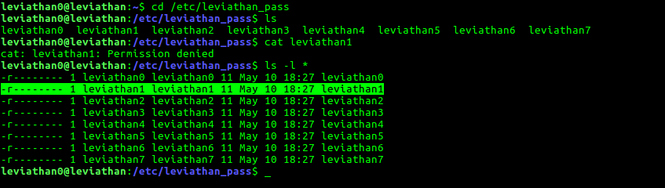
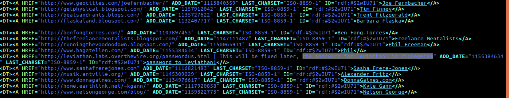

## Level 0: leviathan0

Objective: Find the password to enter Level 1: **leviathan1**.

### This is how I found it:

1. It is given that various levels' passwords can be found in **/etc/password_pass**. So, I went there and tried to open **leviathan1** file, but I did not have sufficient permissions to open it - Only user who can read the contents of that file is **leviathan1**. So ,I thought there should be someway to **escalate** my privileges to **leviathan1** and grab that password.

3. I came back to the **home**(~) directory, because it is told that all the data required to get the password for the next level is present in the home directory.

4. `$ls -al` and this is what I found.

		leviathan0@leviathan:~$ ls -al
		total 24
		drwxr-xr-x  3 root       root       4096 May 10 18:27 .
		drwxr-xr-x 10 root       root       4096 May 10 18:27 ..
		drwxr-x---  2 leviathan1 leviathan0 4096 May 10 18:27 		.backup
		-rw-r--r--  1 root       root        220 May 15  2017 .bash_logout
		-rw-r--r--  1 root       root       3526 May 15  2017 .bashrc
		-rw-r--r--  1 root       root        675 May 15  2017 .profile
		leviathan0@leviathan:~$ 

5. I navigated into the **.backup** directory to get some lead. It had one file **bookmarks.html**. 

6. Opened it in **vi** and searched for **password** expression. 

And there it was. 
This level did not require any privilege escalation or anything. It was straight forward!

### password for leviathan1: rioGegei8m

