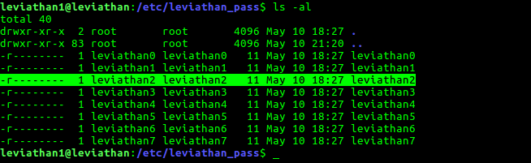
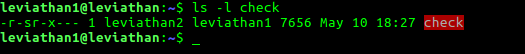
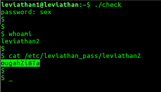

## Level1: leviathan1

Objective: Find the password to enter level2 **leviathan2**

### This is how I found it:

1. The **/etc/leviathan_pass/leviathan2** required privileges of **leviathan2**, which I don't have right now. Should do something to escalate my privileges.

2. In the home directory, there is a **setuid** executable **check**. It is setuid to user **leviathan2**. So, it is clear that we have to exploit this executable to get the required privileges.

3. By just running it, it seems it takes in a password, checks it . 

		leviathan1@leviathan:~$ ./check
		password: qwerty
		Wrong password, Good Bye ...
		leviathan1@leviathan:~$ 
	
4. We now have to find what the password is. Using **ltrace** tool, I checked out what functions it is calling, to get to know how the program is working. This is what I got when I tried to enter qwerty.
	
		leviathan1@leviathan:~$ ltrace ./check
		__libc_start_main(0x565556c0, 1, 0xffffd724, 0x565557a0 <unfinished ...>
		printf("password: ")                                = 10
		getchar(0xf7fc5000, 0xffffd724, 0x65766f6c, 0x646f6700password: q
		) = 113
		getchar(0xf7fc5000, 0xffffd724, 0x65766f6c, 0x646f6700) = 10
		getchar(0xf7fc5000, 0xffffd724, 0x65766f6c, 0x646f6700w
		) = 119
		strcmp("q\nw", "sex")                               = -1
		puts("Wrong password, Good Bye ..."Wrong password, Good Bye ...
		)                = 29
		+++ exited (status 0) +++
		leviathan1@leviathan:~$ 

5. This gave a very important lead. It is not taking a single string and checking the password. It is taking **character by character** , and then checking the whole string using **strcmp**.

6.  I tried to enter **qwerty** character by character when I saw **getchar** function being executed. After I entered **q**, the next **getchar** did not stop to get the character from the user. Next, I entered **w**  and got this **strcmp("q\nw", "sex")** . This means, the second character taken as **\n**. But we never entered it. The fact is, scanf(), getchar() leaves a **\n** in the input buffer after reading the input. So, the first getchar() after reading **q** is leaving a **\n** in the input buffer , which is taken by the second getchar(). That is why, it is not asking the user for an input. 

7. We have come to know, that the password is **sex**, because of the **strcmp**. Let us enter the whole string when the first getchar() asks for input, this newline trouble won't be there. Have a look at this.
		
		leviathan1@leviathan:~$ ltrace ./check
		__libc_start_main(0x565556c0, 1, 0xffffd724, 0x565557a0 <unfinished ...>
		printf("password: ")                                = 10
		getchar(0xf7fc5000, 0xffffd724, 0x65766f6c, 0x646f6700password: sex
		) = 115
		getchar(0xf7fc5000, 0xffffd724, 0x65766f6c, 0x646f6700) = 101
		getchar(0xf7fc5000, 0xffffd724, 0x65766f6c, 0x646f6700) = 120
		strcmp("sex", "sex")                                = 0
		geteuid()                                           = 12001
		geteuid()                                           = 12001
		setreuid(12001, 12001)                              = 0
		system("/bin/sh"$ 
		$ whoami
		leviathan1
		$ 

8. We got the shell, but did not get the required privileges. We will get it if we run it normally without using ltrace. 

And we got it!

### Password for leviathan2: ougahZi8Ta

