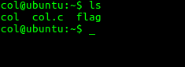
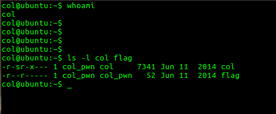
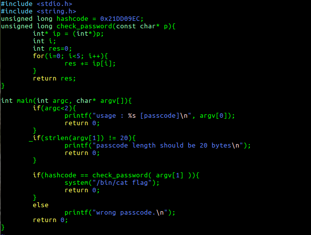
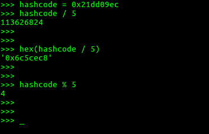
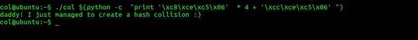

## To pwn: collision

**Question**: **collision** of **Toddler's bottle** section.

Where to pwn: ssh col@pwnable.kr -p2222 (pw:guest)

### How did I pwn it?

1. There are 3 files in the home directory. **col.c**, **col** and **flag**.

* **col** is an executable file, **col.c** is the sourcecode for **col**.
* **flag** is a text file , which has the flag. Which cannot be open because access permissions does not allow you to. 

2. Check out the permissions of **flag** and **col**.

* The user is **col**. 
* The executable **col** is setuid to **col_pwn**. 
* **flag** is belongs to **col_pwn** user and no **other** user can view it. So, as user **col**, it's contents cannot be seen. 

Method is to exploit the setuid executable and view the flag file.

3. Understanding what **col.c** does, will help us exploit it.

* It is pretty simple. We have to pass **1** argument which is **20** bytes long. 

* **hashcode = 0x21dd09ec**

* The function **check_password** takes in the argument we enter as passcode, and it returns certain value. If the returned value is equal to hashcode, it is done.

* Understanding the function **check_password** :
	
	* Pointer **p** points to the whole passcode we have entered. 
	
	* **ip** is the integer pointer to the passcode. As it is an integer pointer, at anytime, it points to 4 bytes of data. 
	
	* Consider this: Suppose entered passcode is **12344567892139482838**. 
		
		* Internally in the stack, this is how this data is stored.
					
				34333231 37363534 31323839 38343933 38333832
		* **0x31** is the ascii equivalent of character **1**. Use the `$ ascii ` command to get ascii values and their characters - for quick reference.
		* In a **32-bit** machine, the stack is **4-byte aligned**, so the gaps for every 4 bytes. 
		* The 4 bytes is in the **reverse** order. This is because of the **little-endian** nature of **stack memory** in **x86 architecture**. 
		* Pointer **p** points to the whole string. 
		* Integer Pointer **ip** initially points only to the first **4** bytes, as **sizeof(int) = 4 bytes**. 
		* So, ip[0] = *(ip + 0) = **0x31323334**.
		* ip[1] = *(ip + 1) = **0x34353637**. When **1** is added to an integer pointer, it is increased by **4 bytes**  to point to the next integer.
		* ip[2] = *(ip + 2) = **0x39383231**
		* ip[3] = *(ip + 3) = **0x33393438**
		* ip[4] = *(ip + 4) = **0x32383338**
	
	* **res** = ip[0] + ip[1] + ip[2] + ip[3] + ip[4]
	
	*  **res** is returned. If res == hashcode, pwned!

* This is the explanation, now pwning!

4. **Exploitation**:

* **hashcode = 0x21dd09ec**. 

* hashcode should be divided into **5 parts** , and those 5 parts should be joined in such a way that **check_password**  returns the **hashcode**. 

* Look at the above screenshot. hashcode is not perfectly divisible by 5. So, Let the **first 4 parts = hashcode / 5**	.The **last part =  (hashcode / 5) + 4**.

* **First 4 parts** = **0x06c5cec8** , **Last part** = **0x06c5cecc** . All the 5 have to joined to get the passcode. 

* Simple concatenation will not work , we have to take care of the **little-endian** stack. So, the passcode will be

	**'\xc8\xce\xc5\x06'  * 4 + '\xcc\xce\xc5\x06'** 

* We can use python in this manner to get the **passcode**.**$(python -c  "print '\xc8\xce\xc5\x06'  * 4 + '\xcc\xce\xc5\x06' ")** . 

* The above python command comes in very handy when you have non-printable character strings as arguments or inputs. 

* **-c** stands for **command line**. The whole python command is enclosed within () and has a $ at the beginning. This indicates, the python command will expand to give the required string and that string is taken as the argument.

### FLAG: daddy! I just managed to create a hash collision :)

---------------

**PS**: A very important concept was used in this question.

1. **Endianess** of an architecture: 

* Endianess is the way data / bytes are stored in memory. There are 2 architectures. **Little-Endian** and **Big-Endian** architectures.

* Consider a 32-bit architecture. Suppose you enter a string **abcdefghij** through scanf(). This is how it is stored in the 2 endian architectures. Suppose the **base address** of string is **0xffff0000**.

	* In Big-Endian arch, this is  how the string is stored.
		
			0xffff0000: 61626364 65666768 696a00ab 3212ffff
			
		* Consider the first 4 bytes - 0x61626364.
		* The **Most significant byte**(**Big End**) is pointed by the address **0xffff0000**. 
		* Just observe the way in which the string is stored. The ascii values are stored in place of the characters. 
		
	* In Little-Endian arch, this is how the string is stored. 
	
			0xffff0000: 64636261 68676665 ab006a69 ffff1232
		* Consider 16 bytes from the base address. 
		*  The **Least significant byte** (**Little End**) is pointed by the address **0xffff0000**.
		
	
	* I hope this example give some clarity of what little-endian and big-endian architectures are.
	
	* The Little-Endian arch has it's own advantages, that is why that design was chosen for a few architectures.
	
	* To get more clarity, open a program in gdb, and look at the stack trace.

