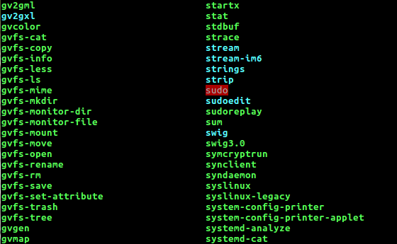

## To pwn: fd

**Question**:  	**fd** of **Toddler's bottle** section.

Where to pwn: ssh fd@pwnable.kr -p2222 (pw:guest)

### How did I pwn it?

1. There are 3 files in the **home** directory. They are **fd**, **fd.c**, **flag** .

	
* The **fd.c** is a C sourcefile, which is the sourcecode for executable **fd**. 
* **flag** is a text file, which we cannot view using a text editor.

2. Checking out the permissions of **fd** and **flag**.

	
* From the above screenshot, 
	* The user is **fd**. 
	* The executable **fd** is **setuid** to **fd_pwn**.
	* The user that owns **flag** file is also **fd_pwn**.
	
* What we can infer from the above is that, **flag** file can be viewed if the setuid executable **fd** is exploited. 

3. Understanding how **fd.c** works , will help us exploit it and get the flag.

* It takes in 2 arguments. The default **argv[0]** is name of the executable(here **fd**, the **argv[1]** here should be a number.
	
	* **fd = atoi( argv[1] ) - 0x1234** 	: fd is an integer, whose value is determined by the argument we pass.
	
* Let us understand the **read** function used here. **read(fd, buf, 32)**
		
	*  **read** is a C library function which reads data from files on execution.
		* It's syntax is:  **ssize_t read(int fd, void *buf, size_t count)**;
		* The **fd** is known as the **File Descriptor**, which is used to refer to the file from which data has to be read. 
		* **buf** is the address of the buffer where the read data is stored into.
		* **count** is the number of bytes to read from the file.
		* **IMP**: The read() function will append a **\n** to the data it reads. 
	
* Let us understand what a File Descriptor is, which will give a lot of lead in pwning this.
		
	* A **File Descriptor** is an integer which is used to refer a file which is created / opened by a particular process. 
	
	* Consider the **cp** command. It has to read data from one file, and write that data into another. So, The way the process refers the 2 files is by using their file descriptors. Each file opened in a process has a **unique** file descriptor.
	
	* The file first should be created/opened(using **open** function). The open function **returns** a **non-zero** integer, which is the **file descriptor** of the file opened. 
		* If you want to read from the file, you have to do it by using that file descriptor returned by open function. 
		* If you want to write into the file, same. You have to do it through the descriptor.
	
	* In Linux, everything is a file. So, every file / device or anything which is opened by a process will have it's file descriptors. 
	
	* Similarly, **Standard Input** / **stdin**, **Standard Output** / **stdout** and  **Standard Error Output** / **stderr** have their own file descriptors which we can use. By default, 
		* fd of **stdin** = 0
		* fd of **stdout** = 1
		* fd of **stderr** = 2
	
	* And by default, stdin, stdout and stderr all are console input and output.
	
	* What this means is, if you want to use any of these standard I/O files, you have to use these file descriptors. 
		* If you want to take user input, you have to **read from stdin**. 
		* If you want to print something on the output, you have to **write to stdout**. 
		* If you have an error statement to print, you can **write to stderr**. 
	

* Consider the condition of if. **!(strcmp("LETMEWIN\n", buf)** .Somehow, if we are able to store **LETMEWIN** in **buf**, we get the flag because, the **system("/bin/cat flag")** will read out what is there in the file **flag**, which is exactly what we want. We have found the method. Now pwning it!

4. 
* Multiple ways to do it. Store the string **LETMEWIN** in a file, then pass an argument such that fd = file descriptor of that file.  We should know the file descriptor before hand to pass the correct argument. This can be guessed, and we can get the guess right also. 
	
* One method is, create a file with **LETMEWIN** text it. Then read it. But this is not the simplest method. 
	
* The easiest method is, pass an argument such that file descriptor = 0, so that we can enter the string **LETMEWIN** and get the flag. 
	
* fd = atoi(argv[1]) - 0x1234. So, to make fd = 0, we have to pass 0x1234 as the argument. 

* 0x1234 = 4660 in decimal. Pass it as argument and **GAME OVER!**.

#### FLAG: mommy! I think I know what a file descriptor is!!

**PS**: There are a few important concepts involved in this problem. 

1. **setuid** :  setuid is a **necessary evil**. 
	
	* Generally, a user can run only the programs which he/she owns. Or the owner of the program should be the user if he/she wants to run it. 
	
	* But there are a few programs, which a user has to run, generally with higher privileges. Take example of the **sudo** program(/usr/bin/sudo). It's user is root, but any standard user can run it. So, any standard user can run a setuid program. 
	
	* Such programs are the **setuid** programs. The programs are **set** to a particular **uid**(**sudo** program is set to uid = 0 / root) **when run**. This means, you are running the program with not your uid, but with uid the program is set to. As **sudo** is set to 0, when you run sudo, **you are running it as root**. 
	
	* To identify setuid programs, in most of the colored-terminals, a setuid program will have a red-colored thing on their name, when you ls it.
	

* In the **ls -l** output, the permissions will be like this.Not that **s** stands for **setuid**.

* Coming to this question, the user is **fd**. But the executable is **setuid** to **fd_pwn**. So, when the executable is run, **uid** of the process is uid of **fd_pwn**. Because of this, it is able to execute **/bin/cat flag**. 

 2. **read** C function: The man page of **read** will give clear details of the function.  

