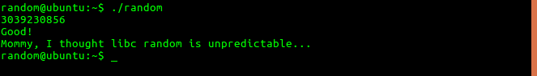

## To pwn: random

**Question** :

>Daddy, teach me how to use random value in programming!

>ssh random@pwnable.kr -p2222 (pw:guest)

### How did I pwn it?

1. There is an executable **random**, it's C sourcecode **random.c** and the **flag** file. 

2. Understanding the sourcecode.
	
			#include <stdio.h>

		int main(){
        unsigned int random;
        random = rand();        // random value!

        unsigned int key=0;
        scanf("%d", &key);

	        if( (key ^ random) == 0xdeadbeef ){
                printf("Good!\n");
                system("/bin/cat flag");
                return 0;
	        }

        printf("Wrong, maybe you should try 2^32 cases.\n");
        return 0;
		}

* **rand()** generates a random value and stores it in **random** variable. The task is to find **key** such that **key ^ random = 0xdeadbeef**. 

* I tried to pwn it in my local machine first. 
* Wrote a small program, which prints **rand()** and a python script which runs the program for 10 times. 

		rand_init_value.c :
		
		#include<stdio.h>

		int main() {
	        printf("Value returned by rand = %x\n", rand());
	        return 0;
		}
	
		script.py :
		
		#!/usr/bin/python

		import os

		os.system("gcc rand_init_value.c -o rand_init_value -m32")

		for i in range(0, 10) :
		        os.system("./rand_init_value")

* I did this to confirm that rand() always generated the same number when called for the first time. That is **0x6b8b4567**. Run the script and see the output . 

2. Pwning it:

* Let a, b, c be 3 numbers. If **a ^ b = c**, then
	* c ^ a = b
	* c ^ b = a

* If we consider a = key, b = random = **0x6b8b4567**, c = **0xdeadbeef**. We have to find **a**, which is given by a = c ^ b. When calculated, I got a = **0xb526fb88**. (wrote a small C program to do this).

*  I have to input **3039230856**(hex(0xb526fb88)) to pwn it.

### FLAG: Mommy, I thought libc random is unpredictable...

--------

**PS** :

1. **rand()** : This function generates the same number when first called. That is why it has to be **seeded** before being called. Found [this](https://stackoverflow.com/questions/1108780/why-do-i-always-get-the-same-sequence-of-random-numbers-with-rand) amazing explanation on stackoverflow. 

